<p align="center">
  
</p>

<div id="user-content-toc" align="center">
  
</div>

---

## 👨‍💻 Sobre Mí

```javascript
const JoelVR = {
    ubicacion: "Lima, Perú 🇵🇪",
    rol: "Ingeniero de Software (con especialización en IA)",
    experiencia: {
        resumen: "3 años desarrollando y analizando sistemas de software complejos, desde aplicaciones de escritorio hasta plataformas web de monitoreo en tiempo real.",
        sectores: ["Marítimo y Pesquero", "Clínico y Sanitario", "Facturación y Ventas"]
    },
    enfoque: [
        "Desarrollo de Sistemas Web a Medida",
        "Análisis y Gestión de Bases de Datos (SQL Server, MySQL)",
        "Integración de Datos de Terceros (APIs, XML)",
        "Diseño de Dashboards para Monitoreo Operativo",
        "Arquitectura de Software Escalable"
    ],
    descripcion: "Ingeniero de Software orientado a resultados con experiencia probada en el diseño,"+
                 "desarrollo y despliegue de soluciones que optimizan operaciones críticas."+
                 "Mi especialidad es la construcción de sistemas back-end robustos que procesan"+
                 "y presentan datos complejos, como la integración de telemetría satelital para la"+
                 "toma de decisiones en tiempo real. Apasionado por la arquitectura de software y la"+
                 "mejora continua de procesos.",
    filosofia: "La buena arquitectura de software hace que el sistema sea elocuente y fácil de entender.",
    objetivos: [
        "Aportar en proyectos de alta disponibilidad y criticidad.",
        "Profundizar conocimientos en arquitecturas serverless y cloud.",
        "Liderar técnicamente el desarrollo de soluciones innovadoras."
    ],
    estudiandoActualmente: ["Clean Architecture", "CI/CD con GitHub Actions", "Optimización de Consultas SQL"],
    datoCurioso: "Disfruto desentrañar la lógica detrás de los flujos de datos complejos, casi tanto como un buen café por la mañana ☕."
};
```  
---

## 🚀 Mis Tecnologías y Herramientas

Este es el stack tecnológico con el que tengo experiencia profesional:
### 💻 Lenguajes de Programación
<p align="center">
  <a href="https://skillicons.dev">
    
  </a>
</p>

### ⚛️ Frontend Development
<p align="center">
  <a href="https://skillicons.dev">
    
  </a>
</p>

### 🔧 Backend Development
<p align="center">
  <a href="https://skillicons.dev">
    
  </a>
</p>

### 🗄️ Bases de Datos
<p align="center">
  <a href="https://skillicons.dev">
    
  </a>
</p>

### 🚀 DevOps & Tools
<p align="center">
  <a href="https://skillicons.dev">
    
  </a>
</p>

---

### 📊 Mis Estadísticas de GitHub

<p align="center">
  
</p>

---

<picture>
  <source media="(prefers-color-scheme: dark)" srcset="https://raw.githubusercontent.com/JoelVR1307/JoelVR1307/output/pacman-contribution-graph-dark.svg">
  <source media="(prefers-color-scheme: light)" srcset="https://raw.githubusercontent.com/JoelVR1307/JoelVR1307/output/pacman-contribution-graph.svg">
  
</picture>

---

### 📫 ¡Conectemos!

Siempre estoy abierto a nuevas oportunidades y colaboraciones. ¡Contáctame!

<p align="center">
  <a href="https://www.linkedin.com/in/cristofer-joel-villanueva-rojas-68a37927b/?originalSubdomain=pe" target="_blank">
    
  </a>
  &nbsp;
  <a href="mailto:cristofer.villa.1307@gmail.com">
    
  </a>
</p>

<p align="center">
  
</p>
